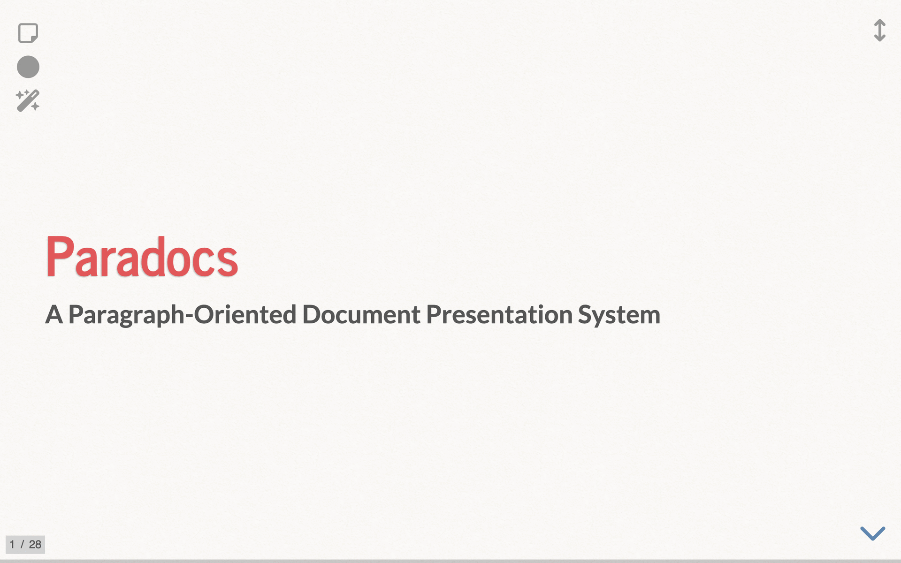

<p align="center">
  
</p>

<h1 align="center">Paradocs</h1>

<p align="center">
  <strong>Paragraph-Oriented Document Presentation System</strong><br>
  <a href="https://yohasebe.github.io/paradocs">https://yohasebe.github.io/paradocs</a>
</p>

---

**Paradocs** is a browser-based presentation tool designed for presenting text documents sentence by sentence. Each key press highlights the next sentence, letting the audience follow exactly where the presenter is focusing. Originally developed for ESL reading classes, it is well-suited for any scenario where you walk through text in a structured way.

All processing runs entirely in the browser — no server, no account, no data sent anywhere.

<p align="center">
  
</p>

## Features

- **Sentence-by-sentence navigation** — Highlight one sentence at a time with keyboard or mouse
- **Text-to-Speech (TTS)** — Read aloud the current sentence with word-level highlighting
- **Automatic presentation** — Auto-advance through all slides with TTS playback
- **Multiple block types** — Headings, paragraphs, static text, ordered/unordered lists, numbered blocks, blockquotes, and tables
- **Media embedding** — Images, YouTube videos, MP4 video, and MP3 audio
- **Quiz features** — Inline fill-in-the-blank quizzes and multiple-choice quizzes (MCQ) with retry
- **Notes and pop-up images** — Annotate sentences with tooltips and image popups
- **Text decoration** — Bold, italic, underline, and highlight with Markdown-compatible syntax
- **Dark mode** — Inverted color scheme for all presentation elements
- **Auto-save** — Text and settings saved to browser local storage automatically
- **HTML export** — Download a standalone HTML file for offline use
- **URL sharing** — Share a direct link to a specific slide and fragment
- **Laser pointer** — Visual pointer mode for emphasis during presentations
- **Sticky notes** — Freeform notes visible during presentation
- **Multi-language** — English and Japanese UI; TTS supports all browser-installed languages

## How It Works

<p align="center">
  
</p>

Write your text with one sentence per line. Separate slides with `----`. That's it.

<p align="center">
  
</p>

For details, see the [full documentation](https://yohasebe.github.io/paradocs) (accessible from the app's Documentation tab).

## Quick Start

1. Open [https://yohasebe.github.io/paradocs](https://yohasebe.github.io/paradocs)
2. Type or paste your text (or use the sample text)
3. Adjust settings (font, colors, language, etc.)
4. Click **Convert Text**
5. Navigate with arrow keys, `j`/`k`, or space bar

### Key Bindings

| Key | Function |
|:----|:---------|
| `↓` / `j` / `SPACE` | Next item |
| `↑` / `k` / `SHIFT+SPACE` | Previous item |
| `.` | Play/stop TTS, video, or audio |
| `a` | Toggle automatic presentation |
| `f` | Fullscreen |
| `s` | Show/hide sticky note |
| `p` | Toggle laser pointer |
| `/` | Screen blackout |
| `ESC` | Overview mode |

## Text Format Example

```text
----
# Introduction

This is the first sentence.
This is the second sentence.
Each line becomes a **highlighted fragment**.

| This is static text.
| It won't be highlighted sentence by sentence.

* Bullet point one
* Bullet point two

| {mcq: What color is the sky?
|   a) Green
|   *b) Blue
|   c) Red
| }

| Name  | Score |
|-------|-------|
| Alice | 95    |
| Bob   | 87    |
----
```

## Architecture

Paradocs is a fully static site — no server-side dependencies.

| Component | File | Role |
|:----------|:-----|:-----|
| Input page | `docs/index.html`, `docs/ja/index.html` | Text editor and configuration form |
| Presentation | `docs/deck.html` | Reveal.js slide viewer |
| Parser | `docs/js/parser.js` | Converts text format to slide HTML |
| CSS generator | `docs/js/helper.js` | Generates presentation styles |
| TTS highlight | `docs/js/tts-highlight.js` | Word-level highlight during TTS |
| Exporter | `docs/js/exporter.js` | Standalone HTML export |

### Key Libraries (via CDN)

jQuery 3.7.1, jQuery UI 1.14.1, Reveal.js 5.2.1, Ace Editor 1.36.5, Bootstrap 5.3.8, Font Awesome 6.7.2, marked 15.x, Tippy.js 6.3.7

## Development

```bash
npm install            # Install dev dependencies
npm test               # Run tests (110 tests)
npm run build:docs     # Rebuild documentation HTML fragments
```

## Deployment

The site is served from the `docs/` folder via GitHub Pages. Push to `master` and configure GitHub Pages to serve from the `docs/` directory.

## License

MIT

## Author

[Yoichiro Hasebe](https://yohasebe.com)
