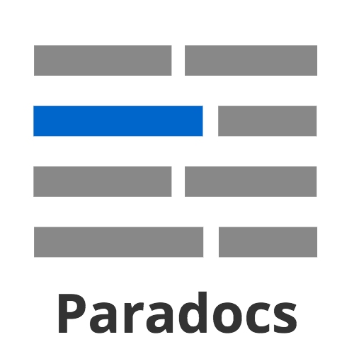
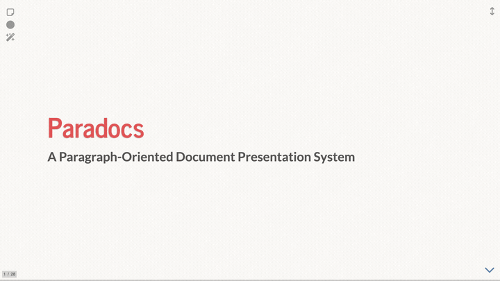
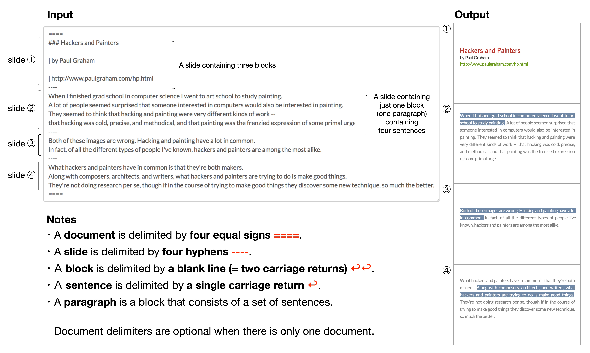
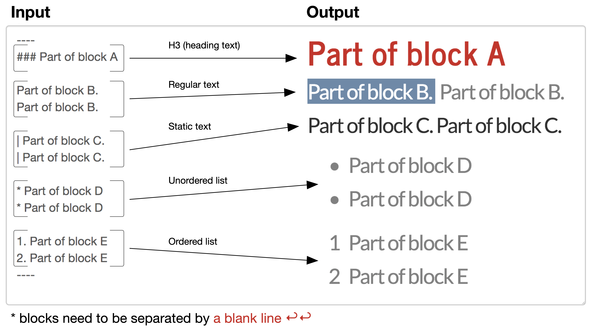

<p align="center">
  
</p>

<h1 align="center">Paradocs</h1>

<p align="center">
  <strong>パラグラフ指向テキスト・プレゼンテーション・システム</strong><br>
  <a href="https://yohasebe.github.io/paradocs/ja/">https://yohasebe.github.io/paradocs/ja/</a>
</p>

---

**Paradocs** は、テキスト文書を一文ずつ提示するブラウザベースのプレゼンテーションツールです。キーを押すたびに次の文がハイライトされ、聴衆はプレゼンターがどこに注目しているかを常に把握できます。

もともとESL（英語教育）のリーディング授業のために開発されましたが、語学レッスン、読書ゼミ、文書レビューなど、テキストを段階的に追っていくあらゆる場面に適しています。

すべての処理はブラウザ内で完結します。サーバー不要、アカウント不要、データの外部送信もありません。

<p align="center">
  
</p>

## 機能

- **一文ずつハイライト** — テキストを一文単位でナビゲーション
- **音声合成（TTS）** — 単語レベルのハイライト付きで文を読み上げ
- **クラウドTTS** — OpenAI・ElevenLabs連携によるストリーミング再生
- **自動プレゼンテーション** — TTSと連動して全スライドを自動進行
- **リッチコンテンツ** — 見出し、リスト、テーブル、静的テキスト、番号付きブロック
- **メディア埋め込み** — 画像、YouTube動画、MP4動画、MP3音声
- **クイズ** — 穴埋め問題と選択式クイズ（リトライ機能付き）
- **ノートとポップアップ** — 任意の文にツールチップや画像ポップアップ
- **テキスト装飾** — 太字、斜体、下線、ハイライト（Markdown互換）
- **ライブプレビュー** — バーチャルスクロール付きフィルムストリップサムネイル
- **ダークモード** — 快適な閲覧のための反転カラー
- **自動保存** — テキストと設定を自動的に保存
- **HTMLエクスポート** — スタンドアロンHTMLファイルとしてダウンロード
- **レーザーポインター＆付箋** — ライブプレゼンテーション用ツール
- **多言語UI** — 英語、日本語、中国語、韓国語

## クイックスタート

1. **[https://yohasebe.github.io/paradocs/ja/](https://yohasebe.github.io/paradocs/ja/)** を開く
2. テキストを入力または貼り付け（サンプルを読み込むことも可能）
3. 必要に応じて設定を調整（フォント、色、TTS言語など）
4. **プレゼン** をクリック
5. 矢印キーまたはスペースバーで進行

## 使い方

**一文を一行で**記述します。スライドの区切りには `---` を使います。

<p align="center">
  
</p>

さまざまなブロックタイプが利用できます：

<p align="center">
  
</p>

書式の詳細と全機能については、[ドキュメント](https://yohasebe.github.io/paradocs/ja/docs.html)ページをご覧ください。

## キーバインド

| キー | 機能 |
|:----|:---------|
| `↓` `j` `SPACE` | 次の項目 |
| `↑` `k` `SHIFT+SPACE` | 前の項目 |
| `.` | TTS・動画・音声の再生/停止 |
| `a` | 自動プレゼンテーションの切り替え |
| `f` | フルスクリーン |
| `s` | 付箋の表示/非表示 |
| `p` | レーザーポインターの切り替え |
| `/` | 画面ブラックアウト |
| `ESC` | オーバービューモード |

> **ヒント：** [Logitech R400/R800](https://www.logitech.com/en-us/presenters) などのワイヤレスプレゼンターとの相性が良く、物理ボタンでナビゲーションとTTS操作が可能です。

## 背景

Paradocsは**2018年**にESLリーディング授業のために開発を始めました。一般的なリーディング授業では、教師も学生も大半の時間を印刷されたテキストに目を落として過ごします。テキストをスクリーンに投影し、一文ずつ追っていくことで、この状況を変えたいと考えました。

それ以来、サーバーベースのツールから**完全なクライアントサイドアプリケーション**へと進化し、すべての処理がサーバー依存なしにブラウザ内で実行されるようになりました。プレゼンテーションエンジンはHakim El Hattab氏の [Reveal.js](https://revealjs.com) を使用しています。背景壁紙は [Transparent Textures](https://www.transparenttextures.com/) を利用しています。

## 開発者向け

Paradocsは完全な静的サイトです。ソースは `docs/` ディレクトリをご覧ください。コントリビューション歓迎です。

```bash
npm install          # 開発依存パッケージのインストール
npm test             # テストの実行
npm run build:docs   # ドキュメントフラグメントの再構築
npm run build:pages  # テンプレートから言語ページを再構築
npm run build        # 両方を実行
```

## ライセンス

MIT

## 著者

[長谷部陽一郎](https://yohasebe.com)
